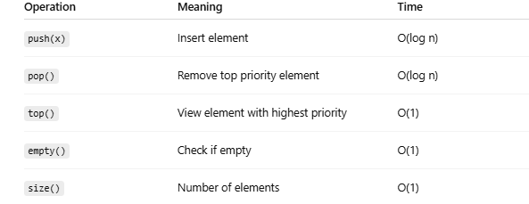

# Priority Queue

## Definition:

- A priority queue is a data structure where each element has a priority, and the element with the highest priority is removed first.
- (In min-heap versions, the smallest element comes out first.)
- It behaves like a queue, but removal is based on priority, not order of insertion.


## How It Works Internally

- A priority queue is usually implemented using a binary heap:
    - Max-heap → largest value removed first
    - Min-heap → smallest value removed first
- Heap operations give O(log n) insertion and removal.

## Common operation



## Priority Queue in C++

- By default, C++ priority queue is a max-heap
```cpp
priority_queue<int> pq;  // max-heap
pq.push(5);
pq.push(2);
pq.push(8);

cout << pq.top(); // 8
```

- Min heap version:
```cpp
priority_queue<int, vector<int>, greater<int>> pq;
```

## Time and space complexity:

- **Time**:
    - Build from n elements: O(n)
    - Push:  O(log n)
    - Pop:   O(log n)
    - Top:   O(1)
- **Space**: O(n)
