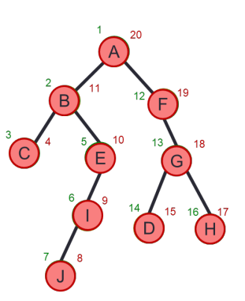

# DFS

## Definition

    - DFS explores a tree/graph by going as deep as possible along one path before backtracking.

## Core Idea:
    1. Start at a node
    2. Visit it
    3. Go to it unvisited neighbors
    4. Repeat until no unvisited neighbors
    5. Backtrack
    6. Continue with other branches

## Iterative DFS (Using Stack)

    - X is a set for Explored
    - F is a set for Frontier (readed but haven't yet explored)
    - U is a set for unreached
    - Can group them to a single set that {X,F,U} st:
    - Set[v]=U if v is in U; Set[v]=F if v is in F; and Set[v]=X if v is in X.

```cpp
DFS(Graph G(V,E), s)
    Initialize stack F and vector set[v] // (Holding values from {X,F,U})
    Set[v] = U for all vertices v except s; // O(V) time
    set[s] = F; Push(s);  // O(1) time
    while stack is not empty  // O(V) time because each vertex is pushed and popped once
        v = Pop;
        for every neighbor u of v // O(E of each v) and will take O(E) when while loop is done
            if set[u] == U
                set[u] == F
                Push(u);
        set[v] = X // O(1) but will execute O(V) times because of the while loop
    return X

/* 
=> Total time analysis =  O(V)    // initialization
                        + O(V)    // push/pop each vertex
                        + O(E)    // scanning all edges
                        + O(V)    // marking transitions
                       =  O(V+E)
=> Space complexity = O(V) for array set[] and O(V) for stack = O(V + V) = O(V)
*/
```

## Recursive DFS

```cpp
dfs(node):
    if node is visited:
        return
    mark node as visited
    for each neighbor v of node:
        dfs(v)

// Call it with: dfs(startNode)
```

## DFS on trees

- Because trees have no cycles:

```cpp
dfs(root):
    if root == null: return
    dfs(root.left)
    dfs(root.right)
```

## DFS augmented to create DFS tree

```cpp
int clock = 1 // global clock

Procudure explote(G(E,V), v)
    visited[v] = true
    pre[v] = clock
    clock ++
    for each edge(v, u) in E
        if not visited[u] then parent[u] = v
            explore (G, u)
    post[v] = clock
    clock ++
```


- **Topological Sort:** Sort vertices in decreasing order of post numbers. Works iff graph is a DAG. 