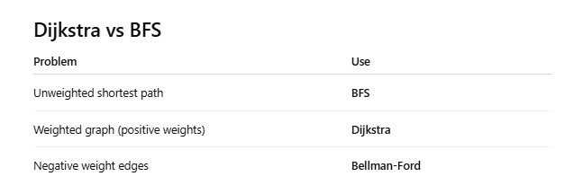

# Dijkstra's Algorithm

## Definition:

- Dijkstra finds the shortest path from a starting node to all other nodes in a weighted graph with non-negative edge weights.
- It is the standard algorithm for shortest paths in real-world networks.

## When you can use:

- Graph can be directed or undirected
- Edge weights must be non-negative
- You want single-source shortest paths

## Key idea

- Use a priority queue (min-heap) to always expand the next closest node.
- Dijkstra keeps a distance[] array of the shortest distances found so far.

## Algorithm steps:

1. Set all distances to ∞
2. Set distance[start] = 0
3. Push (0, start) into a min-priority-queue
4. While queue not empty:
    - Pop the node with smallest distance
    - For each neighbor:
        - If you found a shorter path, update distance and push into heap

## Pseudocode:

```cpp
dijkstra(graph, s):
    dist[v] = ∞ for all v
    dist[s] = 0

    minHeap.push( (0, s) ) // 0 is the weight

    while heap not empty:
        (d, v) = heap.pop() // v with the smallest dist[v]
        if d > dist[v]: continue

        for each edge (v → u) with weight w:
            if dist[v] + w < dist[u]:
                dist[u] = dist[v] + w
                heap.push( (dist[u], u) )

/*
- Time: O((V + E) log V) 
    + because Each edge can cause 1 heap push → E log V and Each vertex is popped at most once → V log V
- Space: O(V)
*/
```

